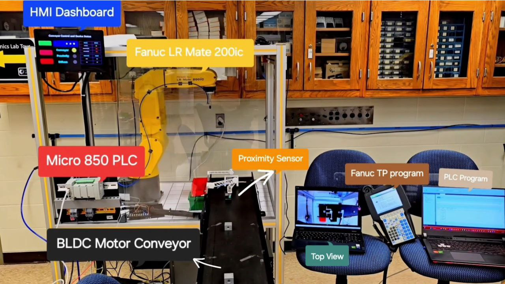
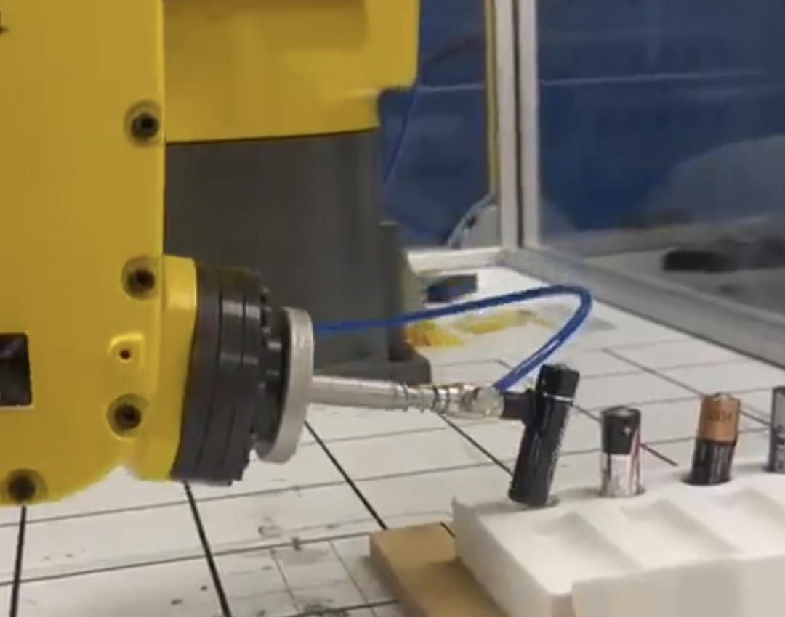
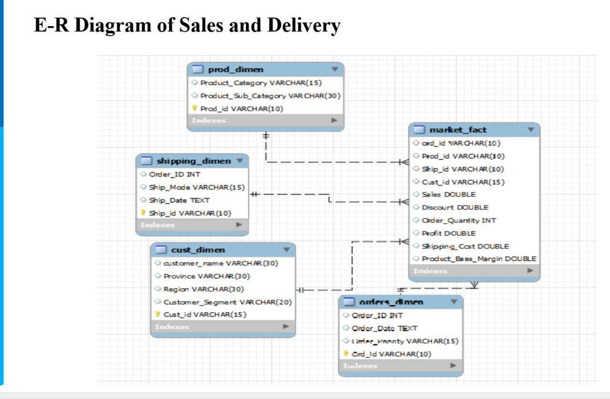
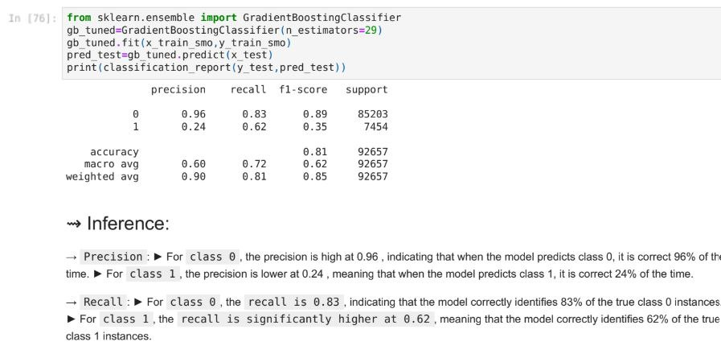

# Industrial Automation Engineer

#### Technical Skills: PLC Programming,HMI, SCADA, FANUC Robot Programming, SQL, Data Analysis.

## Education
- M.S, Mechatronics, Robotics, Automation | Michigan Technological University (_Dec 2025_)								       		
- P.G.P, Data Science and Engineering	| Great Lakes Institute of Management (_Nov 2023_)	 			        		
- B.E., Mechanical Engineering | Visveswaraya Technological University (_Jun 2023_) 

## Work Experience
**Automation Intern @ Global Vacuum Products (_May 2024 - Aug 2024_)**

- Conducted Virtual Robot Cell Simulations using CIMSTATION robotics software for spot welding and material handling 
  applications improving operational accuracy to 95% and reduction of cycle time by 20%.
- Assisted the automation team in developing PLC code and HMI screens utilizing RS Logix 5000  and Factory Talk.
- Gained hands on exposure in working with pneumatics, sensors, actuators and industrial networks.
  

## Projects

### Automated Inspection and Sorting System using FANUC robot and Allen Bradley PLC

[Working_Video](https://drive.google.com/file/d/1zFavhhW5IwPKEUOX1pLkGWlN5phOJ1ts/view?usp=drive_link)

- Built a miniature industrial control panel integrating Allen Bradley MicroLogix 850 PLC, inductive proximity, photoelectric sensors and a drive, Fanuc robot ,while applying advanced wiring technique like employing sourcing and sinking configurations.
- Programmed ladder logic in Connected Components Workbench (CCW) to segregation of good parts and bad parts and utilization of FANUC Robot’s inputs and outputs to automate the process.
- Established PLC-Robot communication via Ethernet IP and programmed FANUC Robot for pick and place operations.
  

### Battery handling using FANUC Robot

[Working_Video](https://drive.google.com/file/d/1s7rbbNLWDFGbCjEYHxYW-8YmuNVPgY4s/view?usp=drive_link)
- Designing robust pick-and-place operations: Developing precise robotic motions to handle inclined objects effectively and utilizing robot's I/O for accurately picking and placing the batteries.
- Tackling challenges in grip precision and orientation adjustments: Ensuring secure handling of irregularly positioned batteries.
- Optimizing robotic motion for efficiency and accuracy: Streamlining movement sequences for reliable performance in repetitive tasks.

### SQL Driven DataBase Management design and Data analysis.

[Report](https://docs.google.com/presentation/d/12dAn-hdMEfNlKBexlSGdcOpKyiXE27LR/edit?usp=drive_link&ouid=115028343743082697341&rtpof=true&sd=true)
- Crafted ER diagrams to clearly illustrate data relationship and schema structure.Utilized SQL to perform advanced data quering and analysis for resturant and supply chain datasets, creating complex queries to extract meaningful information.

### Safety Proposal for Tension Testing Machine
[Report](https://drive.google.com/file/d/1WdcxIctHw6QWlvZSU62fZo6S1yxoz6fD/view?usp=drive_link)
- Objective & Risk Assessment: The project aimed to enhance operator safety and system reliability of a hydraulic tension testing machine by identifying potential hazards through detailed risk assessment, both before and after mitigation.
- Safety Integration: Safety components such as two-hand control (ABB), safety relay, pressure switch, door interlock switch, and block & bleed valve were integrated to reduce risk levels from Performance Level (PL) e/d to PL b across various operational modes.
- Reliability Metrics & Outcome: The improved system achieved high safety standards with MTTFd up to 76.92 years, Diagnostic Coverage above 95%, and CCF exceeding ISO standards—resulting in a compliant, cost-effective safety upgrade (~$7,622) that significantly increases operational safety and reliability.
  
### Prediction of Cardiovascular Disease using Machine Learning

[ML_classification](https://drive.google.com/file/d/199sTHk4ELnh7AEVgIO1uo2BRP1IV_nb9/view?usp=drive_link)
- Led a comprehensive exploration of a Cardiovascular dataset, harnessing the power of 308,854 records and 19 features. Skillfully applied Exploratory Data Analysis and strategic feature engineering to unearth 
  hidden insights. Tackled class imbalance head-on with under-sampling and SMOT techniques. Implemented a suite of Machine Learning classifiers—from Naive Bayes to Gradient Boosting—culminating in a standout 
  performance by Naive Bayes, boasting remarkable accuracy and recall scores. Thrilled to have successfully navigated the complexities of this project
  
### Automobile price prediction using regression models
[ML_regression](https://drive.google.com/file/d/174B42unMLL7iDoApJK_Y4JO0QNXAzlzX/view?usp=drive_link)
- Conducted comprehensive data preprocessing and feature engineering to optimize the dataset for model training and leveraging a range of regression models using python to accurately predict the price of 
  automobile based on features like transmission, fuel type, driven kms ,vehicle manufacturer and owner.

## Certifications
### FANUC CERT Handling Tool and Operations.
  
  

